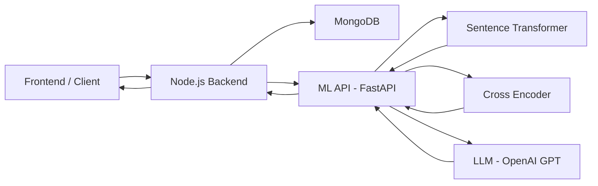
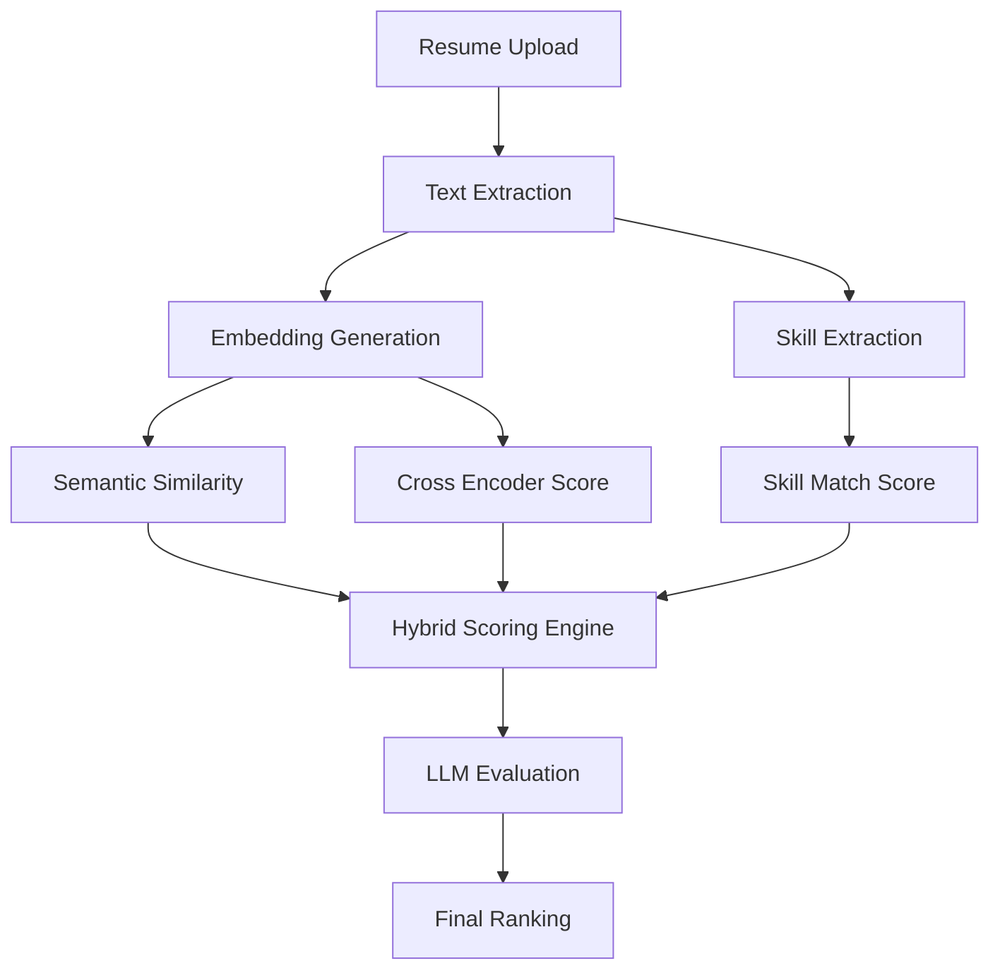
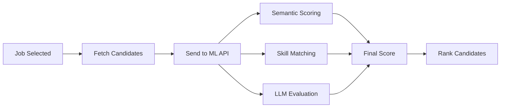
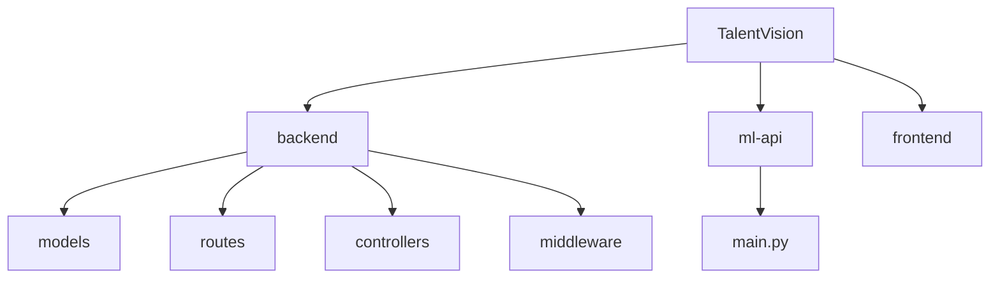

# 🚀 TalentVision — AI-Powered Resume & Candidate Matching System


---

## 🧠 Overview

TalentVision is an **AI-powered recruitment engine** that intelligently matches resumes to jobs and ranks candidates using **Machine Learning + LLM-based evaluation**.

It simulates how a real recruiter evaluates candidates — combining:

* Semantic understanding
* Skill matching
* Experience analysis
* AI reasoning (LLM)

---

## ✨ Features

### 🔐 Authentication & Security

* JWT + Refresh Token system
* Role-based access:

  * Candidate
  * Recruiter
  * Admin
* HttpOnly cookies
* Rate limiting (brute-force protection)

---

### 🤖 AI Resume Matching

* Sentence Transformer embeddings
* Cross-encoder reranking
* Skill extraction (regex + NLP)
* Experience detection
* Hybrid scoring system

---

### 🧠 LLM Recruiter AI

* GPT-powered evaluation
* Human-like reasoning
* Outputs:

  * Score
  * Strengths
  * Weaknesses
  * Explanation

---

### 📊 Candidate Ranking System

* Rank multiple candidates for a job
* AI-based scoring pipeline
* Recruiter-ready output

---

## 🏗️ System Architecture



---

## 🤖 AI Matching Pipeline



---

## 📊 Candidate Ranking Flow



---

## 📁 Project Structure



---

## ⚙️ Setup Instructions

### 1️⃣ Clone Repository

```bash
git clone https://github.com/your-username/TalentVision.git
cd TalentVision
```

---

### 2️⃣ Backend Setup

```bash
cd backend
npm install
```

---

### 3️⃣ Setup Environment Variables

```bash
cp .env.example .env
```

Edit `.env`:

```env
PORT=5000
MONGO_URI=your_mongodb_uri
ACCESS_TOKEN_SECRET=your_secret
REFRESH_TOKEN_SECRET=your_secret
ML_API_URL=http://localhost:8000
OPENAI_API_KEY=your_openai_key
```

---

### 4️⃣ Run Backend

```bash
npm run dev
```

---

### 5️⃣ Setup ML API

```bash
cd ../ml-api
pip install -r requirements.txt
```

Run:

```bash
uvicorn main:app --reload --port 8000
```

---

## 🔗 API Documentation

---

### 🔐 Auth

#### Register

```http
POST /api/auth/register
```

#### Login

```http
POST /api/auth/login
```

#### Refresh

```http
GET /api/auth/refresh
```

#### Logout

```http
POST /api/auth/logout
```

---

### 📄 Resume

```http
POST /api/resumes/upload
```

---

### 💼 Jobs

```http
GET /api/jobs
POST /api/jobs
```

---

### 🤖 AI Matching

```http
POST /match_resume_jobs
```

---

### 🧠 Candidate Ranking (CORE FEATURE)

```http
POST /rank_candidates_for_job
```

#### Request:

```json
{
  "job": {
    "id": "job1",
    "title": "ML Engineer",
    "description": "...",
    "skills": ["python", "ml"]
  },
  "candidates": [
    {
      "id": "user1",
      "resume": "text..."
    }
  ]
}
```

---

#### Response:

```json
{
  "rankedCandidates": [
    {
      "candidateId": "user1",
      "score": 91,
      "llmScore": 94,
      "matchedSkills": ["python", "ml"],
      "reason": "Strong ML experience",
      "strengths": ["ML", "projects"],
      "weaknesses": ["no cloud"]
    }
  ]
}
```


---

## 🔐 Security

* JWT Authentication
* Refresh Tokens
* HttpOnly Cookies
* Rate Limiting
* Role-Based Access Control

---

## 🧠 Tech Stack

### Backend

* Node.js
* Express
* MongoDB (Mongoose)

### AI / ML

* FastAPI
* Sentence Transformers
* Cross Encoder
* OpenAI GPT

### Dev Tools

* ESLint
* Prettier
* Nodemon

---

## 🚀 Future Improvements

* 📊 Recruiter dashboard UI
* 🤖 AI interview question generator
* 📄 Resume improvement suggestions
* 📈 Hiring analytics
* 🌐 SaaS multi-tenant system

---

## ⚠️ Notes

* Do NOT commit `.env`
* Use `.env.example`
* Ensure MongoDB & ML API are running

---

## 👨‍💻 Contributors

**Snehanu Bose , Ahamit Pal**

---

## ⭐ Support

If you like this project, give it a ⭐ on GitHub!
